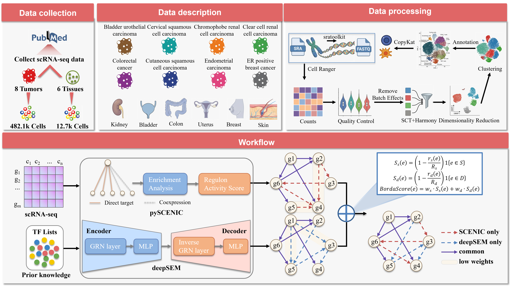

# BCFG: Reconstruction and Analysis of Tumor-Specific Gene Regulatory Networks from scRNA-seq Data

This repository contains the code used in our study:

**"Reconstruction and Analysis of Tumor-Specific Gene Regulatory Networks from scRNA-seq Data"**

We propose **BCFG**, a **rank-normalized weighted Borda consensus framework** that integrates **pySCENIC** and **DeepSEM** to infer high-confidence **tumor-specific gene regulatory networks (GRNs)** from single-cell RNA-seq data.

The pipeline reconstructs GRNs from **pan-cancer single-cell datasets**, removes edges shared with matched normal epithelial tissues, and identifies key transcription factors driving tumor-specific regulatory programs.

------

# Abstract

Gene regulatory networks (GRNs) provide a systems-level view of transcription factor (TF)–target regulation, yet accurate GRN inference from single-cell RNA-seq remains challenging due to sparsity, noise, and strong method-dependent biases.

pySCENIC offers motif- and co-expression–supported, interpretable regulatory priors but is limited in capturing nonlinear and latent causal relationships, whereas DeepSEM can model complex nonlinear dependencies and latent causal structure but may introduce spurious edges without robust priors; integrating both is therefore necessary to improve reliability and coverage.

Here, we present a **rank-normalized, weighted Borda consensus framework (BCFG)** that fuses pySCENIC and DeepSEM predictions under human TF–target constraints to infer high-confidence interactions.

Using **pan-cancer scRNA-seq data (140 samples across eight tumor types)** and a **normal epithelial reference (six tissues)**, we constructed tumor-specific GRNs by removing edges shared with matched normal epithelium to reduce tissue-of-origin confounding.

We then applied **Hyperlink-Induced Topic Search (HITS)** to prioritize hub TFs and performed cross-cancer overlap analysis, identifying recurrent regulators consistent with shared stress/proliferation programs (e.g., AP-1 family members) alongside tumor-type–specific candidates (e.g., SOX2/TP63 in CESC, HNF4A in CRC, PPARGC1A in ChRCC).

Finally, **144 non-overlapping tumor-specific genes** derived from the networks achieved consistently high performance in matched **TCGA classification across diverse models (mean metrics > 0.96)**, supporting the tumor specificity of the inferred features and the validity of the reconstructed tumor-specific GRNs.

------

# Repository Structure

```text
BCFG
│
├── figures
│   ├── Fig.1.png
│   ├── Fig.2.png
│   ├── Fig.3.png
│   ├── Fig.4.png
│
├── GRN
│   ├── argparse_borda.py
│   ├── FinalBatchPyscenic.bash
│   ├── hits.py
│   └── run_deepsem.sh
│
├── dataProcess
│   ├── Copykat.R
│   ├── harmony_sct.R
│   ├── singler.R
│   └── run-cellranger.sh
│
├── Tcga_valid
│   ├── data_spilt.ipynb
│   ├── pycaret - Multiclass Classification.ipynb
│   ├── TabPFN-samedataFoldtcga.ipynb
│   └── tumor_specific_network.py
│
├── Analysis-top50TF
│   └── TF_overlap_statistics.py
│
├── Supplementary_Data.xlsx
├── requirements.txt
└── README.md
```

------

# Workflow Overview

The BCFG pipeline contains four main components.



Overview of the BCFG framework for reconstructing tumor-specific gene regulatory networks from scRNA-seq data.

------

# 1. Single-cell RNA-seq Data Processing

Location

```text
dataProcess/
```

Preprocessing steps include:

- alignment using CellRanger
- tumor cell identification with CopyKAT
- batch correction with Harmony
- cell type annotation using SingleR

Scripts:

| Script            | Description             |
| ----------------- | ----------------------- |
| run-cellranger.sh | Run CellRanger pipeline |
| Copykat.R         | Identify tumor cells    |
| harmony_sct.R     | Batch correction        |
| singler.R         | Cell annotation         |

------

# 2. Gene Regulatory Network Construction

Location

```text
GRN/
```

GRNs are inferred using two complementary methods:

- **pySCENIC** (motif + co-expression based)
- **DeepSEM** (deep learning causal inference)

Scripts:

| Script                  | Description                     |
| ----------------------- | ------------------------------- |
| FinalBatchPyscenic.bash | Run pySCENIC pipeline           |
| run_deepsem.sh          | Run DeepSEM GRN inference       |
| argparse_borda.py       | Borda consensus integration     |
| hits.py                 | TF ranking using HITS algorithm |

BCFG integrates results from both methods using a **rank-normalized weighted Borda scoring scheme**.

------

# 3. Tumor-Specific GRN Construction

Location

```text
Tcga_valid/tumor_specific_network.py
```

Tumor-specific regulatory edges are obtained by removing edges shared with matched normal epithelial networks.

Edge categories:

- Tumor-specific edges
- Normal-specific edges
- Shared edges

------

# 4. TCGA Machine Learning Validation

Location

```text
Tcga_valid/
```

To validate tumor-specific genes derived from GRNs, we perform classification on TCGA  data.

Models used:

- PyCaret benchmark models
- TabPFN transformer classifier

Scripts:

| Script                                    | Description      |
| ----------------------------------------- | ---------------- |
| data_spilt.ipynb                          | Train/test split |
| pycaret - Multiclass Classification.ipynb | ML benchmarking  |
| TabPFN-samedataFoldtcga.ipynb             | TabPFN           |

Performance metrics include:

- Accuracy
- Recall
- Precision
- F1 score
- MCC
- Kappa

------

# 5. Transcription Factor Analysis

Location

```text
Analysis-top50TF/
```

Key TFs are prioritized using the **HITS algorithm**, and cross-cancer overlap analysis identifies common and tumor-type-specific regulators.

Script:

```text
TF_overlap_statistics.py
```

------

# Data Description

A summary of datasets used in this study is provided in:

```
Supplementary Table 1 Data .xlsx
```

This file contains:

- dataset sources
- sample information
- tumor types
- normal reference tissues

------

# Requirements

All required packages and versions are listed in

```
requirements.txt
```

Install dependencies using

```bash
pip install -r requirements.txt
```

Main dependencies include

- Python >= 3.9
- pandas
- numpy
- scikit-learn
- pycaret
- tabpfn
- joblib

For R scripts:

- Seurat
- Harmony
- CopyKAT
- SingleR

------

# Example Usage

Run GRN consensus integration

```bash
python GRN/argparse_borda.py
```

Run TCGA classification

```bash
jupyter notebook Tcga_valid/pycaret - Multiclass Classification.ipynb
```

Run TabPFN validation

```bash
jupyter notebook Tcga_valid/TabPFN-samedataFoldtcga.ipynb
```

Generate tumor-specific networks

```bash
python Tcga_valid/tumor_specific_network.py
```

------

# Citation

If you use this repository in your research, please cite:

```
Reconstruction and Analysis of Tumor-Specific Gene Regulatory Networks from scRNA-seq Data
```

Citation details will be updated after publication.

------

# License

This repository is released under the MIT License.